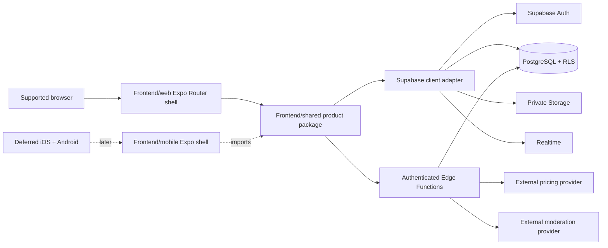
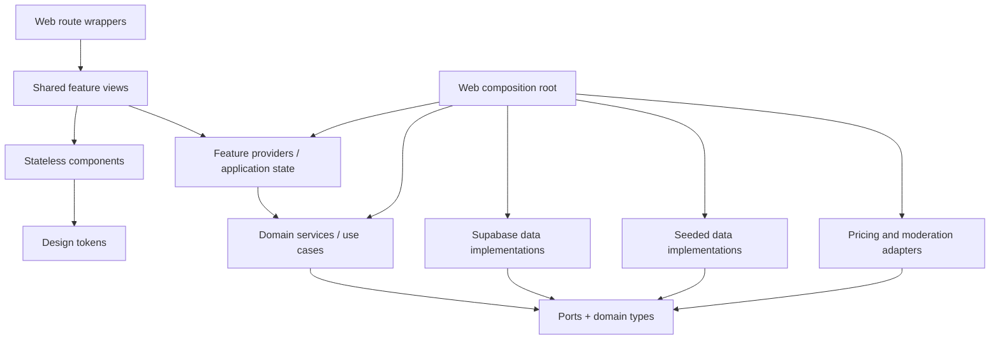

# Design Document: SnapWorth Web

## Overview

SnapWorth Web is an authenticated, mobile-first valuation and peer-to-peer marketplace application delivered first as an Expo web application in `Frontend/web/`. The design separates that deployable web shell from reusable product code in `Frontend/shared/` so the later iOS and Android delivery can use one deferred Expo mobile shell in `Frontend/mobile/` without duplicating product behavior. All clients use one backend in `Backend/`.

The product-level design question is:

> How do you make an automatic price feel confident enough to act on, while staying honest that it is only a guess?

The answer is structural rather than decorative: every AI value uses a dedicated `EstimateBadge`, every seller value uses a separate `AskingPriceBadge`, the item and compressed photo are durable before estimation begins, and listing publication requires a fresh owner-entered price. The interface uses the original SnapWorth token system and Off+Brand-derived method without copying OFF+BRAND assets, marks, layouts, or trade dress.

### Goals

- Deliver every required browser route from `Frontend/web/` using Expo Router.
- Place route-neutral UI, application state, domain rules, ports, validation, and infrastructure implementations in `Frontend/shared/`.
- Preserve one-way dependencies so screens cannot bypass domain rules or backend authorization.
- Support deterministic seeded mode and Supabase mode through the same contracts.
- Make capture, persistence, estimation, history, Feed, Marketplace, and their failure states implementable from this document.
- Establish compile-time and runtime barriers between AI estimates and seller asking prices.
- Define backend tables, Storage layout, row-level security (RLS), Realtime authorization, and Edge Function boundaries for all platforms.
- Keep Chat, cross-posting, and Admin Review behind complete seams while allowing their UI delivery to remain lower priority.

### Non-goals

- Native iOS or Android application delivery in this phase.
- Payments, escrow, shipping, logistics, or identity verification.
- Provider selection beyond normalized pricing and moderation contracts.
- OFF+BRAND visual assets, source code, distinctive compositions, or trade dress.
- Server-side rendering as a requirement. SnapWorth is an authenticated application; client rendering with an initial session gate is the baseline.

### Design principles

1. **Durability precedes inference.** The compressed photo and item record become durable before the estimate request starts.
2. **Price semantics are types and components, not conventions.** Estimate and asking-price values have distinct types, storage fields, validation paths, and renderers.
3. **Authorization is enforced below the browser.** Route guards improve navigation; RLS, Storage policies, authenticated Edge Functions, and transactional database functions enforce security.
4. **Ports keep modes replaceable.** Seeded and Supabase implementations satisfy identical application-facing interfaces.
5. **Screens compose; components render.** Route files contain route parsing and layout selection only. Shared views consume provider state and stateless components.
6. **The slow and failed paths are first-class.** Every route has applicable loading, empty, offline, and failed states from the screen briefs.
7. **One idea per view.** Each route uses the screen brief’s question, dominant element, and single filled primary action.

### Research findings

The design was checked against current official platform guidance:

- [Expo Router](https://docs.expo.dev/router/introduction/) provides file-based routing for React Native and web, which supports a web-owned route tree now and a second mobile route tree later while shared views remain route-neutral.
- [Expo web guidance](https://docs.expo.dev/workflow/web/) supports app-like client-rendered websites, matching an authenticated product whose first visible step is session resolution.
- [Expo’s Supabase guide](https://docs.expo.dev/guides/using-supabase) confirms the intended combination of Auth, PostgreSQL, Storage, Edge Functions, and Realtime from an Expo client.
- [Supabase data API security guidance](https://www.supabase.com/docs/guides/database/data-api) treats RLS as the row-authorization boundary; therefore browser route checks are never considered data security.
- [Supabase Edge Function security](https://supabase.com/docs/guides/functions/auth), [function secrets](https://supabase.com/docs/guides/functions/secrets), and [Realtime authorization](https://supabase.com/docs/guides/realtime/authorization) support authenticated server functions, browser-excluded secrets, and participant-scoped realtime delivery.

These findings lead to a client-rendered Expo Router web shell, injected Supabase infrastructure, RLS on every exposed table and Storage bucket, and authenticated Edge Functions as the only code permitted to contact AI providers. Content from the linked sources was rephrased for compliance with licensing restrictions.

## Architecture

### System context



The web and future mobile shells are composition roots. They may import every shared layer solely to construct dependencies, but route modules import only shared presentation/application entry points. Provider credentials never cross the Edge Function boundary.

### Repository and package topology

```text
Frontend/
├── package.json                      # npm workspace root for web, shared, later mobile
├── web/
│   ├── package.json                  # Expo web deployable
│   ├── app.config.ts
│   ├── metro.config.js
│   ├── tailwind.config.js            # imports shared NativeWind/token preset
│   ├── app/
│   │   ├── _layout.tsx               # providers, theme, session gate, responsive shell
│   │   ├── index.tsx                 # session/onboarding redirect only
│   │   ├── (auth)/{login,signup,reset-password}.tsx
│   │   ├── (product)/_layout.tsx     # authenticated shell
│   │   ├── (product)/onboarding.tsx
│   │   ├── (product)/capture.tsx
│   │   ├── (product)/history.tsx
│   │   ├── (product)/feed.tsx
│   │   ├── (product)/marketplace.tsx
│   │   ├── (product)/item/[id].tsx
│   │   ├── (product)/post/[id].tsx
│   │   ├── (product)/list/[id].tsx
│   │   ├── (product)/listing/[id].tsx
│   │   ├── (product)/chat/{index,[id]}.tsx
│   │   └── (product)/admin/review.tsx
│   └── src/
│       ├── bootstrap/createDependencies.ts
│       └── shell/{ResponsiveShell,WebNavigation}.tsx
├── shared/
│   ├── package.json                  # platform-neutral TypeScript/React Native package
│   └── src/
│       ├── design/{tokens,nativewind-preset,theme}.ts
│       ├── components/{ui,item,feed,market,chat}/
│       ├── features/
│       │   ├── auth/                 # providers, state machines, route-neutral views
│       │   ├── onboarding/
│       │   ├── capture/
│       │   ├── history/
│       │   ├── feed/
│       │   ├── marketplace/
│       │   ├── chat/
│       │   └── admin/
│       ├── services/                 # domain use cases and orchestration
│       ├── ports/                    # repository/provider/clock/id/network interfaces
│       ├── data/
│       │   ├── supabase/             # repositories, RPC and Storage clients
│       │   └── seeded/               # deterministic in-memory implementations
│       ├── adapters/
│       │   ├── pricing/              # mock and Edge Function clients
│       │   └── moderation/           # deterministic and Edge Function clients
│       ├── validation/               # image, comment, message, money, filter parsers
│       ├── types/                    # branded IDs, money, entities, results, errors
│       └── testing/                  # generators, fakes, fixed seed fixtures
└── mobile/
    └── README.md                     # deferred; later one Expo shell for iOS + Android
Backend/
├── supabase/
│   ├── config.toml
│   ├── migrations/
│   ├── seed/
│   ├── functions/
│   │   ├── _shared/{auth,cors,errors,rate-limit,providers}/
│   │   ├── estimate-price/index.ts
│   │   └── moderate-content/index.ts
│   └── tests/                        # pgTAP/RLS and Edge Function tests
└── scripts/                          # local reset/seed commands only
```

The current `Frontend/` layer folders are planning placeholders. The authoritative `agents/AGENTS.md` and confirmed architecture supersede that pre-split location: reusable contents move conceptually under `Frontend/shared/`, while Expo Router ownership moves to `Frontend/web/app/`. This is a location correction, not a change to the six logical boundaries.

### Layer boundaries and dependency direction



Dependency rules:

- `web/app` imports feature views and app-level guard selectors; route wrappers do not import services, Supabase, repositories, or AI adapters.
- Components are stateless, perform no fetches, and import only types and design tokens.
- Feature providers own async state, optimistic state, form state, and orchestration. Providers call services through injected interfaces.
- Services own invariants and initiate outward work, but compile-time dependencies point inward to `ports/`. This dependency inversion resolves the older README statement that services are “the only layer permitted to talk outward” without coupling domain code to Supabase.
- `data/supabase`, `data/seeded`, and provider adapters are sibling infrastructure implementations. They cannot import feature providers or views.
- Only the shell composition root selects infrastructure implementations. No route contains `if (seeded)` branches.
- Cross-service dependencies are replaced with narrow collaborators where practical: `CaptureItem` depends on an estimate requester, `PublishFeedPost` and `PublishListing` depend on moderation, and listing contact depends on a conversation port. Cycles are forbidden.
- TypeScript path aliases and ESLint import-boundary rules enforce these constraints.

### Deployment topology

- `Frontend/web` builds a static Expo web bundle served over HTTPS. All product authorization remains in Supabase; no security assumption depends on static hosting.
- Browser-visible configuration contains only the Supabase project URL, publishable/anonymous key, runtime mode, and non-secret feature flags.
- `Backend/supabase` is the single migration and function source for web and future native clients.
- Production runtime mode is fixed to `supabase`; startup fails closed if a mock pricing adapter, permit-all moderation adapter, or seeded repository is selected.
- Preview and local environments may use either a local Supabase project or deterministic seeded mode.

### Route ownership and navigation

Expo Router files in `Frontend/web/app/` own browser URLs and route parameters. Each route wrapper parses parameters into branded IDs, renders one shared feature view, and selects the appropriate shell slot. Route groups do not add URL segments.

| URL | Web owner | Shared view | Guard |
|---|---|---|---|
| `/` | `app/index.tsx` | splash/session resolution only | redirect decision |
| `/login` | `(auth)/login.tsx` | `LoginView` | public; authenticated users redirect |
| `/signup` | `(auth)/signup.tsx` | `SignupView` | public; authenticated users redirect |
| `/reset-password` | `(auth)/reset-password.tsx` | `ResetPasswordView` | public |
| `/onboarding` | `(product)/onboarding.tsx` | `OnboardingView` | authenticated + incomplete onboarding |
| `/capture` | `(product)/capture.tsx` | `CaptureView` | authenticated |
| `/item/[id]` | `(product)/item/[id].tsx` | `ItemDetailView` | authenticated + item authorization |
| `/history` | `(product)/history.tsx` | `HistoryView` | authenticated |
| `/feed` | `(product)/feed.tsx` | `FeedView` | authenticated |
| `/post/[id]` | `(product)/post/[id].tsx` | `PostDetailView` | authenticated + visible post |
| `/list/[id]` | `(product)/list/[id].tsx` | `CreateListingView` | authenticated + item owner |
| `/marketplace` | `(product)/marketplace.tsx` | `MarketplaceView` | authenticated |
| `/listing/[id]` | `(product)/listing/[id].tsx` | `ListingDetailView` | authenticated + visible/owned listing |
| `/chat` | `(product)/chat/index.tsx` | `ConversationListView` | authenticated; feature seam may be disabled |
| `/chat/[id]` | `(product)/chat/[id].tsx` | `ConversationView` | participant only |
| `/admin/review` | `(product)/admin/review.tsx` | `AdminReviewView` | administrator only |

`RootSessionGate` has three states: `resolving`, `anonymous`, and `authenticated`. The root route waits on `resolving` without flashing a login or protected screen. An authenticated profile’s `onboarding_completed_at` selects `/onboarding` or `/capture`. The product layout redirects anonymous users to `/login`; the admin wrapper redirects non-administrators to `/capture`. These are navigation controls only—RLS repeats every authorization rule.

Malformed branded IDs produce a route-level not-found/error state and never reach a repository. Unauthorized and nonexistent private records return the same public-facing not-found response to prevent existence disclosure.

### Responsive web shell

Responsive values are named layout tokens, not ad hoc media-query literals:

- `compact` (`320–767 CSS px`): single content column, persistent bottom navigation, full-width sheets, and Capture as the central/default destination.
- `medium` (`768–1199 CSS px`): compact navigation rail, content column up to `layout.contentMedium`, two-column Feed/Marketplace grids where card minimum width remains valid.
- `expanded` (`1200–1920 CSS px`): full labeled navigation rail, centered content up to `layout.contentWide`, and an optional contextual secondary pane for item/listing detail. The secondary pane may duplicate context but cannot hide an action available in compact mode.

The shell uses safe-area and browser inset values, supports keyboard navigation, and permits horizontal scrolling only inside explicitly horizontal controls such as `FilterBar`. Grid columns derive from minimum card width, not device names. At 200% text zoom the grid collapses before text clips. Route content order remains equivalent across breakpoints so keyboard and screen-reader reading order do not diverge from visual order.

Each visible route retains the screen brief’s dominant element and one filled primary action. Desktop width adds whitespace and context; it does not add competing primary actions.

### Cross-cutting application state

Providers are feature-scoped and expose discriminated unions rather than independent booleans:

```ts
type AsyncState<T> =
  | { status: 'idle' }
  | { status: 'loading'; previous?: T }
  | { status: 'ready'; data: T }
  | { status: 'empty' }
  | { status: 'offline'; previous?: T; recoverableInput?: unknown }
  | { status: 'error'; error: AppError; previous?: T; canRetry: boolean };
```

Global providers are limited to `AuthProvider`, `ThemeProvider`, `NetworkProvider`, `MotionPreferenceProvider`, and the dependency container. Item, Feed, Marketplace, Chat, and Admin providers mount at their route boundaries to avoid global rerenders and unwanted data subscriptions.

Feature state machines define valid transitions:

- Capture: `idle → selected → compressing → persisting → estimating → estimated | estimateFailed | queuedOffline`.
- Vote: `confirmed → pending(desired) → confirmed(serverResult) | confirmed(previous)+error`.
- Public submission: `draft → submitting → held | approved | error`.
- Listing form: `empty → editingInvalid | editingValid → publishing → held | active | error`.
- Message: `draft → pending(clientMessageId) → delivered | failed(retryableDraft)`.

No error transition discards a selected photo, entered asking price, comment draft, or message draft when recovery is possible.

## Components and Interfaces

### Design tokens and NativeWind

`Frontend/shared/src/design/tokens.ts` is an immutable typed object and the only source of color, typography, spacing, radius, elevation, breakpoint, content-width, touch-target, and motion values. It contains the exact semantic light/dark colors, Space Grotesk and Inter typography, 4-point spacing scale, radii, and motion durations defined by the authoritative design skill.

`nativewind-preset.ts` converts tokens into NativeWind theme entries. `Frontend/web/tailwind.config.js` imports that preset and declares only content paths. Theme selection maps semantic color tokens to web CSS custom properties and corresponding React Native values; components request semantic names such as `bg-canvas` rather than raw colors. A static check rejects literal hex colors and off-scale visual values outside token files.

Fonts load once in the root layout. Monetary text uses Space Grotesk with tabular figures; UI/body text uses Inter. Text containers use `minHeight` and padding rather than fixed heights. `allowFontScaling` is never disabled; hero prices use a maximum multiplier of 1.6 and other text 2.0.

Automated contrast tests verify every supported foreground/background and interactive-boundary pairing at 4.5:1 for normal text and 3:1 for large text and UI boundaries. Any failing pair is changed in the token source rather than patched in a component.

### Core UI contracts

All interactive primitives provide at least a 44 × 44 CSS pixel/point hit area, visible focus, disabled and pending semantics, and keyboard activation. Icon-only controls require `accessibilityLabel`. Status components use `role`, live-region behavior, and text/icon/shape cues in addition to color.

```ts
interface ErrorStateProps {
  title: string;
  message: string;
  retryLabel?: string;
  onRetry?: () => void;
}

interface EmptyStateProps {
  title: string;
  message: string;
  action?: { label: string; onPress: () => void };
}

interface ProgressIndicatorProps {
  kind: 'content-skeleton' | 'estimate-wait' | 'inline';
  label: string;
  progress?: number; // omitted when progress cannot be measured honestly
}
```

A blank-screen spinner is not supported. List skeletons preserve the final card aspect ratio. `OfflineBanner` announces network-dependent limitations without claiming that local selection or draft data was lost.

### Estimate and asking-price contracts

The domain uses integer minor units and branded semantics:

```ts
type CurrencyCode = 'USD';
type MinorUnits = number & { readonly __brand: 'MinorUnits' };
type AiEstimateAmount = MinorUnits & { readonly __meaning: 'AiEstimate' };
type AskingPriceAmount = MinorUnits & { readonly __meaning: 'AskingPrice' };

interface AiEstimate {
  amount: AiEstimateAmount;
  currency: CurrencyCode;
  confidence?: { lower: AiEstimateAmount; upper: AiEstimateAmount };
  providerRef: string;
}

interface AskingPrice {
  amount: AskingPriceAmount;
  currency: CurrencyCode;
  confirmedBy: UserId;
  confirmedAt: string;
}
```

Only the pricing response normalizer can construct `AiEstimateAmount`. Only `parseAndConfirmAskingPrice(rawInput, ownerId, clock)` can construct `AskingPriceAmount`; the function accepts user input and has no estimate parameter. Database columns and API payloads retain separate names.

`EstimateBadge` and `AskingPriceBadge` are separate exports and share no public variant abstraction:

```ts
interface EstimateBadgeProps {
  estimate: AiEstimate;
  size: 'hero' | 'card' | 'reference';
  testID?: string;
}

interface AskingPriceBadgeProps {
  askingPrice: AskingPrice;
  size: 'large' | 'card';
  testID?: string;
}
```

`EstimateBadge` always renders:

1. `AI ESTIMATE` overline;
2. formatted estimate value on `estimate.surface` with a one-point dashed `estimate.border`;
3. `Estimate only — not a listing price.` directly beneath the value.

No prop can hide or replace those elements. The dashed treatment is private to this component. `AskingPriceBadge` always renders the `ASKING PRICE` overline and value with the settled solid treatment; it has no estimate caption and cannot accept an `AiEstimate`.

### Item and collection components

- `PhotoFrame` requires source, meaningful alternative text, aspect ratio, loading fallback, and failure fallback. Every `ItemCard`, `PostCard`, and `ListingCard` requires a photo; no text-only variant exists.
- `PostCard` makes photo and estimated value dominant, limits title to two lines, and composes `EstimateBadge` in card size.
- `ListingCard` composes `AskingPriceBadge`; optional estimate context must be a separate `EstimateBadge` reference.
- `VoteBar` accepts confirmed counts, current vote, pending vote, ownership, and callbacks. Each choice has text, icon, shape, and color. Selecting the current vote requests withdrawal.
- `FilterBar` owns no query logic. It receives typed filter state, active count, clear callback, and available facets. Clear remains visible whenever any filter is active.
- `ChatBubble` distinguishes direction by alignment, surface, and an accessible sender label; delivery state is textual and not color-only.

### Application-facing service ports

All async operations return `Result<T, AppError>` and accept an `AbortSignal` where cancellation is meaningful. Repository failures are normalized; vendor and Supabase payloads do not cross a port.

```ts
interface AuthService {
  observeSession(listener: (session: Session | null) => void): Unsubscribe;
  signUp(credentials: Credentials): Promise<Result<Session, AuthError>>;
  signIn(credentials: Credentials): Promise<Result<Session, AuthError>>;
  signOut(): Promise<Result<void, AppError>>;
  resetPassword(email: EmailAddress): Promise<Result<void, AuthError>>;
}

interface ItemService {
  capture(input: SelectedImage, signal?: AbortSignal): Promise<Result<StoredItem, CaptureError>>;
  retryEstimate(itemId: ItemId, signal?: AbortSignal): Promise<Result<StoredItem, EstimateError>>;
  getOwnedItem(itemId: ItemId): Promise<Result<StoredItem, AppError>>;
  listHistory(cursor?: Cursor): Promise<Result<Page<StoredItem>, AppError>>;
  deleteOwnedItem(itemId: ItemId): Promise<Result<void, AppError>>;
}

interface FeedService {
  publish(itemId: ItemId): Promise<Result<FeedPost, ModerationError>>;
  list(cursor?: Cursor): Promise<Result<Page<FeedPost>, AppError>>;
  get(postId: PostId): Promise<Result<FeedPostDetail, AppError>>;
  unpublish(postId: PostId): Promise<Result<void, AppError>>;
}

interface VoteService {
  setVote(postId: PostId, desired: VoteChoice | null): Promise<Result<VoteSnapshot, VoteError>>;
}

interface CommentService {
  submit(postId: PostId, body: CommentBody): Promise<Result<CommentReceipt, ModerationError>>;
  remove(commentId: CommentId): Promise<Result<void, AppError>>;
  report(target: PublicContentRef, reason: ReportReason): Promise<Result<ReportId, AppError>>;
}

interface ListingService {
  parsePrice(raw: string): Result<AskingPriceDraft, ValidationError>;
  publish(itemId: ItemId, confirmed: AskingPriceDraft): Promise<Result<Listing, ModerationError>>;
  browse(filter: MarketFilter, cursor?: Cursor): Promise<Result<Page<Listing>, AppError>>;
  get(listingId: ListingId): Promise<Result<ListingDetail, AppError>>;
}
```

Deferred interfaces are still complete enough to prevent future route-contract changes:

```ts
interface ChatService {
  openOrReuse(listingId: ListingId): Promise<Result<ConversationId, AppError>>;
  listConversations(): Promise<Result<ConversationSummary[], AppError>>;
  getAuthorized(id: ConversationId): Promise<Result<ConversationDetail, AppError>>;
  send(id: ConversationId, body: MessageBody, clientId: ClientMessageId): Promise<Result<Message, AppError>>;
  subscribe(id: ConversationId, listener: MessageListener): Unsubscribe;
  block(userId: UserId): Promise<Result<void, AppError>>;
}

interface AdminReviewService {
  listQueue(cursor?: Cursor): Promise<Result<Page<ModerationCase>, AppError>>;
  resolve(caseId: ModerationCaseId, decision: 'approve' | 'remove', expectedVersion: number): Promise<Result<ModerationCase, AppError>>;
}
```

### Seeded mode and Supabase mode

`createDependencies(config)` validates one runtime configuration and returns the same service graph in both modes:

```ts
type RuntimeConfig =
  | { mode: 'seeded'; seed: number; scenario?: SeedScenario }
  | { mode: 'supabase'; url: string; publishableKey: string };
```

Seeded repositories are deterministic stateful fakes, not arrays embedded in screens. A seed controls IDs, dates, prices, moderation outcomes, and pagination. Scenario flags can produce pricing timeout, moderation unavailable, empty collections, offline transitions, and failed sends. Seeded auth simulates anonymous, user, owner, and administrator sessions without accepting real credentials.

Supabase repositories implement the same ports. Service and feature tests run against a repository contract suite that both implementations must pass. Switching mode changes only the composition root. Seed fixtures use normalized domain records, not Supabase row shapes, so replacing seeded data cannot alter route contracts.

Production startup enforces all of the following: `mode === 'supabase'`, moderation adapter is authenticated Edge Function, pricing adapter is authenticated Edge Function, and no permit-all implementation is registered. The Edge Function also rejects any production publication request carrying a development adapter marker, providing server-side defense in depth.

### Capture, persistence, and estimation sequence

Supported browser inputs are JPEG, PNG, and WebP up to 20 MiB. Image validation happens before transformation. Compression corrects orientation, limits the long edge to 2048 pixels, emits WebP or JPEG according to browser support, strips metadata not required for display, and targets a payload no larger than 2 MiB. If the target cannot be met without crossing the configured quality floor, capture returns a specific limit error and retains access to selection.

```mermaid
sequenceDiagram
    actor U as User
    participant V as CaptureView/Provider
    participant I as ItemService
    participant C as ImageCompressor
    participant R as ItemRepository
    participant S as Private Storage
    participant E as Pricing Adapter
    participant F as estimate-price Edge Function

    U->>V: select image
    V->>I: capture(selected image)
    I->>C: validate and compress
    C-->>I: normalized upload payload
    I->>R: create item(status=storing)
    R-->>I: itemId + owner-scoped path
    I->>S: upload compressed photo
    S-->>I: stored object version
    I->>R: finalize item(photoPath, estimation=estimating)
    Note over I,R: Item and photo are durable; History now shows estimating
    I->>E: estimate(itemId, signed server-readable reference, idempotencyKey)
    E->>F: authenticated request
    F->>F: verify owner, rate limit, call provider
    F-->>E: normalized estimate or explicit failure
    alt estimate returned
        E-->>I: AiEstimate
        I->>R: persist estimate and set estimated
    else timeout/provider/network failure
        E-->>I: typed retryable error
        I->>R: set failed or queued_offline
    end
    I-->>V: durable StoredItem state
```

The repository allocates an item before upload so the Storage path is stable. The item is not considered a `StoredItem` and estimation cannot start until `finalize item` proves both row and object exist. A failed upload leaves a non-history `storing` row eligible for cleanup and keeps the selected browser `File` in provider state. Finalization and the first `estimating` history state are one database transaction/RPC.

Every estimate request uses an item-scoped idempotency key and attempt number. Retry reads the existing item/photo; it never creates a second item or upload. A stale response cannot overwrite a newer attempt because persistence compares `attempt_number`. The Edge Function returns an explicit failure before ten seconds, and the client abort deadline is slightly above the server deadline to receive that structured response.

After two seconds unresolved, `/item/[id]` shows `ProgressIndicator(kind='estimate-wait')` over the already visible photo. On success, the photo settles and the hero estimate reveals for 420 ms. Reduced Motion Mode skips transform/count-up and presents the final number immediately. On failure, the route says the photo remains saved and offers retry. If offline after persistence, it says the estimate is queued/retryable without claiming background execution the browser cannot guarantee.

### Feed, votes, comments, and moderation

Feed publication calls the moderation Edge Function with an authenticated item reference. The function verifies ownership, creates a `pending` post, screens normalized public text/image metadata, then atomically marks the post `approved` or `held`. Public Feed queries return only `approved` and non-withdrawn posts; owners may read their own pending/held records.

Votes use one transactional database RPC, `set_vote(post_id, desired_choice_or_null)`. The RPC verifies that the post is visible and the voter is not the owner, upserts or deletes the `(post_id, voter_id)` row, and returns the caller’s confirmed choice plus all three aggregate counts. A unique primary key guarantees one active vote. The provider applies a pending projection immediately, but a failure restores the last server-confirmed snapshot and exposes retry.

Comments follow fail-closed moderation:

1. Validate and normalize a non-empty bounded plain-text body locally.
2. Submit through `moderate-content` with an idempotency key.
3. Insert as `pending`; only the Edge Function/service role may transition to `approved`.
4. On provider uncertainty or outage, transition to `held`, visible only to the author and administrators.
5. Public thread queries include only approved, non-deleted comments.

React Native text rendering treats comments as text, never executable markup. Reports append a moderation case and do not immediately disclose reporter identity to content owners. Owner deletion sets `deleted_at` and removes content from public queries while retaining the minimum moderation audit reference.

### Manual asking-price and listing flow

`/list/[id]` loads an owner-authorized item and renders its estimate only through a non-editable `EstimateBadge(size='reference')`. The asking-price input is initialized to the empty string on every new listing draft. No initializer receives the estimate.

The money parser accepts a locale-presented decimal string, normalizes the active locale’s grouping/decimal separators, rejects ambiguous forms, and produces positive integer USD cents from `0.01` through `999,999,999.99`. Publication remains disabled until parsing succeeds and the owner explicitly submits. The service reconstructs `AskingPrice` from the submitted raw value and authenticated owner; it does not trust a branded object supplied by the UI.

Publication verifies item ownership and absence of an active listing for the same item, then sends the listing through fail-closed moderation. Approved listings become `active`; uncertain listings become `held`. The asking price remains seller-confirmed regardless of moderation state. Cross-posting, when enabled later, reuses `item_id` and photo but repeats manual asking-price confirmation when going from Feed to Marketplace. Going from Marketplace to Feed preserves asking price only as asking-price context and never relabels the value as an estimate.

### Marketplace and filtering

Marketplace browse uses stable cursor pagination ordered by `(published_at DESC, id DESC)`. `MarketFilter` contains optional category, inclusive minimum/maximum cents, and an optional location constraint. Invalid ranges are rejected before querying. SQL applies all filters with AND semantics and always includes `status = 'active'` and moderation approval.

Category and price filters ship with the should-have Marketplace. Location remains behind `locationFilterEnabled`; when disabled, no location control is rendered and location data is not requested. When enabled, the initial implementation uses a normalized region code rather than precise coordinates to minimize sensitive data collection. Active filter state is encoded in URL search parameters on web, allowing refresh/back navigation without changing shared filter contracts.

A filtered empty response includes active filter metadata so `MarketplaceView` can name at least one filter to relax. Clearing filters resets all typed filter state and the cursor atomically. Listing detail hides buyer contact for owners and disables it for sold/withdrawn listings.

### Deferred Chat, cross-post, and Admin seams

Chat and Admin routes exist in the route map, but delivery can be feature-flagged until their priority tier begins. A disabled seam renders an honest unavailable state; it never redirects to a nonexistent feature.

- Chat data contracts, RLS, and message idempotency are designed now. Realtime subscriptions mount only while an authorized thread is active. Pending messages use a client-generated ID; failed sends preserve text.
- Conversation uniqueness is `(listing_id, buyer_id, seller_id)`, so contact opens or reuses one thread.
- Blocks are symmetric at query/send time: a block by either participant prevents new messages.
- Cross-post records reuse `item_id`; separate post/listing records preserve estimate/asking-price semantics.
- Admin decisions use optimistic concurrency (`expectedVersion`) so duplicate decisions fail with a conflict. Admin role comes from protected authorization metadata, not a client-editable profile field.

### Operational states, motion, and accessibility

The shared screen views implement all states from `screen-briefs.md`. The baseline state inventory is:

| Area | Loading/wait | Empty | Failure/offline | Success-specific |
|---|---|---|---|---|
| Auth | submitting | n/a | invalid credentials, reset error, offline | reset sent |
| Capture | capturing, compressing, uploading | permission not granted | invalid media, upload failed, offline with photo retained | selected/persisted |
| Item | estimating with photo | n/a | estimate failed + retry, queued offline | estimated + history confirmation |
| History | card skeleton | first-run path to Capture | retryable load/delete error | populated grid |
| Feed/Post | card/thread skeleton, vote/comment pending | no posts/no comments | rollback vote, held notice, blocked/retry | approved content |
| Listing form | publishing | empty price, publication disabled | invalid price, moderation/publish failure | held or active |
| Marketplace | card skeleton | global empty, filtered empty naming filter | retryable load error/offline | active listings |
| Chat | thread/list skeleton, sending | no conversations/messages | blocked, send failed with text | delivered/unread |
| Admin | queue skeleton, action pending | empty queue | decision conflict/retry | ordered queue |

Motion is limited to state communication: estimate reveal, estimation wait, vote tally shift, and 140–200 ms opacity/position transitions. `useMotionPreference()` reads and subscribes to operating-system reduced-motion preference. Reduced mode prohibits transforms and count-up, uses immediate values or opacity, and exposes identical information.

Accessibility design includes semantic headings and landmarks on web, deterministic focus order, focus restoration after route/dialog changes, keyboard activation for every control, Escape handling for dismissible sheets, visible tokenized focus rings, accessible names for photos and icon controls, live announcements for estimate/vote/moderation/message status, non-color cues, and no focus theft during optimistic refreshes. Modal focus is trapped and returned to its trigger. At 200% text size, content grows or reflows; monetary values may wrap but never clip.

## Data Models

### Domain types

All IDs are branded UUID strings. Dates cross boundaries as ISO 8601 UTC strings. Money is a safe integer of minor units plus ISO currency. Domain constructors reject unsafe integers, negative estimate values, non-positive asking prices, invalid state transitions, and malformed cursors.

```ts
interface StoredItem {
  id: ItemId;
  ownerId: UserId;
  photo: PhotoRef;
  title?: string;
  category?: Category;
  estimation: EstimationState;
  createdAt: string;
  updatedAt: string;
}

type EstimationState =
  | { status: 'estimating'; attempt: number; startedAt: string }
  | { status: 'estimated'; attempt: number; estimate: AiEstimate; completedAt: string }
  | { status: 'failed'; attempt: number; code: EstimateFailureCode; retryable: boolean }
  | { status: 'queued_offline'; attempt: number };

interface FeedPost {
  id: PostId;
  itemId: ItemId;
  ownerId: UserId;
  moderationStatus: ModerationStatus;
  publicationStatus: 'published' | 'withdrawn';
  voteCounts: Record<VoteChoice, number>;
  publishedAt?: string;
}

interface Listing {
  id: ListingId;
  itemId: ItemId;
  sellerId: UserId;
  askingPrice: AskingPrice;
  category: Category;
  regionCode?: string;
  moderationStatus: ModerationStatus;
  status: 'held' | 'active' | 'sold' | 'withdrawn';
  publishedAt?: string;
}
```

### PostgreSQL schema

All public-schema tables have RLS enabled and default-deny policies. Database enums or checked text columns constrain status and choice values.

| Table | Important columns and constraints | Purpose |
|---|---|---|
| `profiles` | `user_id PK/FK auth.users`, `display_name`, `onboarding_completed_at`, timestamps | User-visible profile and first-run state; admin role is not user-editable here |
| `items` | `id`, `owner_id`, `photo_path`, `photo_alt`, `category`, `storage_status`, `estimation_status`, `current_attempt`, `deleted_at`, timestamps | Private durable item and History source |
| `estimate_attempts` | `(item_id, attempt_no) PK`, `status`, `amount_cents`, `currency`, `provider_ref`, `failure_code`, timestamps | Idempotent estimate history and stale-response protection |
| `feed_posts` | `id`, `item_id`, `owner_id`, `moderation_status`, `publication_status`, `published_at`, `deleted_at`; one non-withdrawn post per item | Public Feed projection |
| `votes` | `(post_id, voter_id) PK`, `choice`, `updated_at`; check enum | One active vote per user/post |
| `comments` | `id`, `post_id`, `author_id`, `body`, `moderation_status`, `deleted_at`, timestamps | Moderated thread content |
| `listings` | `id`, `item_id`, `seller_id`, `asking_price_cents > 0`, `currency`, `category`, `region_code`, `moderation_status`, `status`, `published_at`; one active/held listing per item | Marketplace records |
| `conversations` | `id`, `listing_id`, `buyer_id`, `seller_id`, `latest_message_at`; unique listing/buyer/seller; buyer != seller | Listing-scoped threads |
| `messages` | `id`, `conversation_id`, `sender_id`, `client_message_id`, `body`, `delivery_state`, timestamps; unique sender/client ID | Idempotent messages |
| `blocks` | `(blocker_id, blocked_id) PK`, timestamp; blocker != blocked | Prevent new messages |
| `moderation_cases` | `id`, `target_type`, `target_id`, `source`, `priority`, `status`, `version`, `decision`, timestamps | Held/reported queue and concurrency control |
| `reports` | `id`, `case_id`, `reporter_id`, `reason`, timestamp; unique reporter/target | Public-content reports |
| `rate_limit_events` | hashed subject, function, time bucket, count | Server-only provider abuse control |

Public list/detail queries use database views or RPC results that join only approved public fields and signed/photo delivery information. They do not grant direct read access to another user’s private `items` row. Vote counts are calculated through a grouped view/RPC or maintained transactionally; the database result is authoritative.

Indexes cover:

- `items(owner_id, created_at DESC, id DESC)` excluding deleted rows;
- `feed_posts(moderation_status, publication_status, published_at DESC, id DESC)`;
- `comments(post_id, moderation_status, created_at, id)`;
- `listings(status, moderation_status, published_at DESC, id DESC)` plus category, price, and optional region composites;
- `conversations(buyer_id, latest_message_at DESC)` and seller equivalent;
- `messages(conversation_id, created_at, id)`;
- `moderation_cases(status, priority DESC, created_at, id)`.

### Storage model

A private `item-photos` bucket stores compressed originals at `{owner_uuid}/{item_uuid}/source.{ext}`. The database stores only the path and object version, never a permanent public URL. Owner-authorized item views use short-lived signed URLs. Approved public Feed/Marketplace queries use a server-controlled image delivery path or narrowly scoped signed URLs generated only after the public-record policy succeeds.

Storage policies require `auth.uid()` to equal the first path segment for owner upload/read/delete. Object type and size are checked before upload client-side and repeated by trusted finalization metadata/server validation. No user can list another owner’s prefix. Storage cleanup is idempotent and driven by item deletion/retention jobs.

### RLS and authorization matrix

| Resource | Read | Create/change | Delete/resolve |
|---|---|---|---|
| `profiles` | authenticated public-safe fields; full own record | own safe fields only | account workflow only |
| `items`, attempts | owner only | owner through constrained RPC/repository | owner; deletion RPC handles dependents |
| visible Feed projection | authenticated users, approved + published only | owner submits through moderation function | owner withdraws; admin moderation separately |
| `votes` | authenticated users on visible posts | caller only; RPC rejects own post and enforces one row | caller through same RPC |
| `comments` | approved visible comments; author can also see own held comment | authenticated author through moderation function | author soft-delete; admin decision through privileged function |
| visible Marketplace projection | authenticated users, approved active records; owner can see own held/closed | owner through listing publication function | owner marks sold/withdrawn |
| conversations/messages | participants only | participant; send policy checks listing/thread state and blocks | no client hard-delete |
| moderation queue | administrators only | trusted moderation function/report policy | administrator resolution RPC with version check |
| rate limits | no browser access | Edge Function service role only | service role retention job |

Administrator authorization derives from protected auth application metadata exposed through a database helper that callers cannot mutate. Security-definer functions set a fixed `search_path`, validate `auth.uid()`, expose only required operations, and revoke broad execute privileges.

### Realtime model

Chat uses private participant-scoped subscriptions to `messages` filtered by authorized conversation. RLS applies to the subscribed rows. The client first loads a cursor page, then subscribes, de-duplicates by message ID/client ID, and orders by server timestamp plus ID. Reconnect performs a delta query from the last confirmed cursor so missed events are recovered.

Feed tallies do not require broad Realtime subscriptions. The initiating vote RPC returns the authoritative tally; list refresh or narrowly scoped post subscriptions may update other viewers later. This avoids a large fan-out channel in the must-have path.

### Edge Function contracts

`estimate-price` request:

```ts
interface EstimatePriceRequest {
  itemId: ItemId;
  attempt: number;
  idempotencyKey: string;
}
```

The function authenticates the JWT, verifies item ownership and finalized photo existence, enforces a per-user and per-item rate limit, creates a short-lived server-readable photo reference, calls the configured provider with a hard deadline, normalizes the response, and persists/returns only the normalized estimate. Provider errors become stable codes (`timeout`, `rate_limited`, `provider_unavailable`, `invalid_response`).

`moderate-content` request uses a target type (`feed_post`, `comment`, or `listing`), target ID, and idempotency key. The function verifies authorship, reads canonical content from the database, applies rate limits, calls the provider, and transitions only `pending → approved | held`. Clients cannot submit an `approved` verdict.

CORS permits configured web origins, but CORS is not authorization. Both functions validate auth on every request. Provider API keys, service-role capabilities, and rate-limit internals exist only in function secrets/server code and are omitted from logs and responses. Structured logs use request IDs and redacted identifiers.

### Deletion and retention

Deleting an item removes it from History immediately through `deleted_at`. The transactional deletion operation first withdraws any Feed Post and Listing and prevents new interactions. Private photos are then deleted asynchronously and idempotently; a retry queue handles transient Storage failure. Items with moderation/audit dependencies retain a minimal tombstone containing IDs, ownership hash, and timestamps while user content and photo are removed. Moderation decisions retain decision metadata without retaining deleted public text longer than the configured policy. Exact retention durations are environment policy values and do not alter route contracts.

## Correctness Properties

*A property is a characteristic or behavior that should hold true across all valid executions of a system—essentially, a formal statement about what the system should do. Properties serve as the bridge between human-readable specifications and machine-verifiable correctness guarantees.*

Property-based testing is appropriate for SnapWorth’s pure validation, state transitions, query models, rendering contracts, and port substitutability. It is not used to repeatedly test Supabase, browser layout, Storage, Realtime, or deployed infrastructure; those criteria use example, integration, smoke, accessibility, and performance tests.

The acceptance-criteria prework considered every clause. Reflection consolidated properties where one invariant subsumed another: capture ordering is one property, estimate success is one atomic transition, vote operations are compared to one reference model, public moderation uses one fail-closed invariant, and filter behavior uses one model. The following properties each add distinct validation value.

### Property 1: Route guards resolve deterministically

For any required route, simulated session, onboarding state, and role, the Route Guard produces exactly the destination or access decision defined by the route-access table; anonymous users cannot receive a Product Route and non-administrators cannot receive Admin Review.

**Validates: Requirements 2.6, 2.7, 2.9, 19.1**

### Property 2: Recoverable input survives offline transitions

For any valid selected photo, asking-price draft, comment draft, or message draft, transitioning a network-dependent feature to offline preserves the recoverable input exactly and identifies the network dependency.

**Validates: Requirements 3.6, 16.7**

### Property 3: Uploads contain validated compressor output

For any supported source image accepted by the Capture Flow, every network upload is derived from the completed compressor output rather than the uncompressed source; for any image outside supported type or size boundaries, no upload occurs and photo selection remains available.

**Validates: Requirements 4.1, 17.6, 17.7**

### Property 4: Durable storage precedes automatic estimation

For any successful capture, the first estimate request occurs exactly after the item row and compressed photo are both durable, and History exposes that same item in the `estimating` state when the request begins.

**Validates: Requirements 4.2, 4.3, 4.4, 4.6**

### Property 5: Successful estimation is associated atomically

For any durable item and normalized AI estimate returned for the item’s current attempt, persistence associates the unchanged normalized estimate with that item and changes History to `estimated`; a response for an older attempt does not overwrite the current attempt.

**Validates: Requirements 4.7, 4.8**

### Property 6: Estimate failure preserves the durable item and retries in place

For any durable item and retryable pricing failure, the item ID and photo reference remain unchanged in History, the state remains retryable, and retry increments the attempt without creating another item or uploading another photo.

**Validates: Requirements 4.9, 4.10, 4.11**

### Property 7: EstimateBadge anatomy is invariant

For any valid AI Estimate, supported badge size, and theme, `EstimateBadge` renders the `AI ESTIMATE` overline, the formatted estimate in the provisional dashed treatment, and the exact caption `Estimate only — not a listing price.`

**Validates: Requirements 5.2, 5.3, 5.4**

### Property 8: AskingPriceBadge anatomy is invariant

For any confirmed Asking Price, supported badge size, and theme, `AskingPriceBadge` renders `ASKING PRICE`, the same monetary amount formatted for display, and the settled solid treatment.

**Validates: Requirements 5.5, 5.6, 10.7**

### Property 9: Provisional styling is exclusive to estimates

For any rendered SnapWorth monetary component tree, the provisional dashed-border token occurs only inside `EstimateBadge`, and an Asking Price is never accepted by `EstimateBadge` or rendered with provisional semantics.

**Validates: Requirements 5.7**

### Property 10: Every item representation includes an accessible photo

For any Stored Item, Feed Post, or Listing representation, the rendered card/detail contains the associated item photo and a non-empty accessible description.

**Validates: Requirements 5.8, 15.15**

### Property 11: Private destination has no public side effect

For any estimated Stored Item, selecting Private Destination leaves the Feed Post and Listing sets unchanged while retaining the item in History.

**Validates: Requirements 6.6**

### Property 12: Public destination setup preserves price meaning

For any Stored Item and AI Estimate, beginning Feed publication does not construct an Asking Price, and beginning Marketplace listing initializes the raw Asking Price field to the empty string rather than to any representation of the estimate.

**Validates: Requirements 6.7, 6.8, 10.2**

### Property 13: Feed publication preserves association and visibility rules

For any eligible Stored Item and moderation outcome, Feed publication associates the resulting post with the same item, and public Feed results contain the post if and only if the post is approved, published, and not deleted.

**Validates: Requirements 7.1, 7.2, 7.3**

### Property 14: Cursor pagination is stable and complete

For any finite ordered set of visible Feed Posts or active Listings and valid page size, traversing returned cursors produces each eligible record exactly once in the defined stable order, with no duplicate or omitted record.

**Validates: Requirements 7.4, 11.2**

### Property 15: Unpublishing removes public visibility idempotently

For any published Feed Post, unpublishing once or repeatedly produces the same withdrawn state and excludes the post from every subsequent public Feed query.

**Validates: Requirements 7.6**

### Property 16: Vote operations match the one-vote reference model

For any visible Feed Post, set of non-owner users, and sequence of vote selections, changes, and withdrawals, the persisted active votes equal a map keyed by `(post, user)`, and the three returned tallies equal the grouped values in that map after every operation.

**Validates: Requirements 8.1, 8.2, 8.3, 8.4**

### Property 17: Owners cannot change their own post tally

For any Feed Post and its owner, every attempted owner Vote returns the owner-vote error and leaves active votes and aggregate counts unchanged.

**Validates: Requirements 8.5**

### Property 18: Vote rendering and rollback preserve confirmed truth

For any confirmed Vote snapshot, desired next choice, and failed Vote request, each choice remains identifiable by text and icon, and failure restores exactly the prior confirmed choice and counts while exposing a retry action.

**Validates: Requirements 8.6, 8.8**

### Property 19: Public-content moderation fails closed

For any Feed Post, Comment, or Listing submission, the content is absent from other users’ public results until an approval verdict is persisted; review verdicts and moderation transport/provider failures result in `held`, not `approved`.

**Validates: Requirements 9.1, 9.2, 9.3, 9.4, 10.8**

### Property 20: Comment deletion and reporting preserve thread policy

For any approved Comment owned by the caller, deletion excludes the Comment from public thread queries; for any reportable visible target and valid reason, reporting creates a moderation report whose target identity matches the reported content.

**Validates: Requirements 9.7, 9.8**

### Property 21: Asking-price parsing preserves valid cents and rejects invalid publication

For any permitted positive USD cent amount and supported locale, formatting the amount as editable input and parsing/confirming it produces the original cents; for any empty, nonnumeric, ambiguous, non-positive, fractional-cent, or overflow input, publication remains disabled and no Listing write occurs.

**Validates: Requirements 10.3, 10.4, 10.5**

### Property 22: Marketplace results equal the filter model

For any collection of Listings, category, inclusive price range, optional region constraint, and location-feature state, Marketplace results equal exactly the approved active Listings satisfying every enabled filter, including both price endpoints.

**Validates: Requirements 11.1, 11.3, 11.4, 11.5**

### Property 23: Filter controls derive from active filter state

For any Marketplace filter state, the clear control is available if and only if at least one filter is active; when results are empty with active filters, every suggested filter to relax belongs to the active set.

**Validates: Requirements 11.6, 11.7**

### Property 24: Listing actions reflect status and ownership

For any Listing and Authenticated User, sold or withdrawn status prevents buyer contact, and identity equality between viewer and seller replaces buyer contact with owner actions.

**Validates: Requirements 11.9, 11.10**

### Property 25: Listing contact reuses one correctly ordered conversation

For any active Listing, buyer, and seller, repeated contact initiation returns one Conversation for the tuple; for any set of that user’s Conversations, list output is in descending latest-message order with deterministic tie-breaking.

**Validates: Requirements 12.1, 12.2**

### Property 26: Message failures and blocks preserve safe conversation state

For any valid non-empty message, unresolved delivery exposes the same body under its client message ID, failed delivery preserves that body for retry, and a block in either participant direction prevents insertion of a new message.

**Validates: Requirements 12.5, 12.7, 12.8**

### Property 27: Cross-posting preserves item and monetary semantics

For any eligible Feed Post or Listing while Cross-Post is enabled, the result reuses the same item/photo; Feed-to-Marketplace requires fresh manual Asking Price confirmation, and Marketplace-to-Feed retains the seller value as an Asking Price in a field distinct from the AI Estimate.

**Validates: Requirements 13.1, 13.2, 13.3, 13.4**

### Property 28: Admin queue ordering is deterministic

For any set of unresolved moderation cases, Admin Review orders cases by descending priority, then ascending submission time, then stable ID.

**Validates: Requirements 14.2**

### Property 29: Admin resolution is single-winner and policy preserving

For any unresolved Held Content case and concurrent decisions using the same version, at most one decision succeeds; approval makes eligible content publicly visible, while removal retains decision metadata and keeps content nonpublic.

**Validates: Requirements 14.3, 14.4, 14.5**

### Property 30: Interactive semantics do not rely on visual color alone

For any rendered Product Route state, there is at most one filled Primary Action, every icon-only control has an accessible name, and every color-coded status or choice also has a text, icon, shape, or pattern cue.

**Validates: Requirements 15.5, 15.6, 15.7**

### Property 31: Token contrast meets the applicable threshold

For any declared semantic foreground/background or interactive-boundary token pairing, the computed contrast ratio is at least 4.5:1 when classified as normal text and at least 3:1 when classified as large text or a UI boundary.

**Validates: Requirements 15.8, 15.9**

### Property 32: Themes resolve every semantic token

For any component-consumable semantic color token, both light and dark themes resolve a valid color value without falling back to a raw component literal.

**Validates: Requirements 15.14**

### Property 33: Reduced motion preserves semantic output

For any view model and sanctioned animated state transition, Reduced Motion Mode renders no transform or count-up and produces semantic text, values, actions, and accessibility output equivalent to standard motion.

**Validates: Requirements 16.3, 16.4**

### Property 34: Retryable errors remain actionable

For any normalized retryable application error, the corresponding feature state identifies the failed operation, exposes an enabled retry action, and retains any previous confirmed data or recoverable input.

**Validates: Requirements 16.6**

### Property 35: Estimation progress appears at the threshold with the photo retained

For any unresolved estimate request whose elapsed time reaches two seconds, the item view contains estimation progress and the associated item photo; before two seconds, delayed-progress presentation is not required.

**Validates: Requirements 17.2**

### Property 36: Production configuration fails closed

For any runtime configuration or public-content request marked as production, selecting seeded data, mock pricing, or permit-all moderation prevents startup or publication rather than falling back to permissive behavior.

**Validates: Requirements 18.10**

### Property 37: Seeded providers are deterministic and normalized

For any seed and normalized pricing or moderation request, repeated seeded-adapter execution produces equivalent normalized success/error results, and no vendor-specific field appears above the adapter boundary.

**Validates: Requirements 19.3, 19.4, 19.5**

### Property 38: Repository implementations are substitutable

For any repository contract scenario expressible in both modes, seeded and Supabase implementations satisfy the same domain result/state-transition contract without changing a Product Route view model.

**Validates: Requirements 19.7**

### Property 39: Equivalent provider failures produce equivalent feature states

For any configured mock failure and equivalent normalized Edge Function failure, the application produces the same retryability classification, retained data, user-facing operation label, and allowed next actions.

**Validates: Requirements 19.8**

### Property 40: History selection preserves item identity

For any History entry selected by an Authenticated User, navigation targets `/item/[id]` with the exact branded ID of the selected Stored Item.

**Validates: Requirements 6.3**

## Error Handling

### Error algebra

Infrastructure errors are normalized at the boundary into a discriminated application error:

```ts
type AppError =
  | { kind: 'validation'; code: string; field?: string; limit?: string }
  | { kind: 'authentication'; code: 'invalid_credentials' | 'email_taken' | 'session_expired' }
  | { kind: 'authorization'; code: 'not_found_or_denied' }
  | { kind: 'offline'; operation: OperationName; retryable: true }
  | { kind: 'timeout'; operation: OperationName; retryable: true }
  | { kind: 'rate_limited'; operation: OperationName; retryAfterSeconds?: number; retryable: true }
  | { kind: 'conflict'; code: string; retryable: boolean }
  | { kind: 'provider'; code: string; retryable: boolean }
  | { kind: 'storage'; stage: 'upload' | 'finalize' | 'delete'; retryable: boolean }
  | { kind: 'unknown'; requestId: string; retryable: boolean };
```

Views never parse raw Supabase/vendor messages. A centralized copy map turns stable codes into specific, actionable text while logs retain the request ID. Unknown errors use safe generic copy and do not reveal table names, policies, provider identities, stack traces, or record existence.

### Recovery behavior

| Failure | Persistent state | User behavior | Retry behavior |
|---|---|---|---|
| Invalid/oversized image | no item/upload | state limit and keep chooser available | choose another image |
| Compression failure | no upload | keep source selection in current session | retry compression/reselect |
| Item-row creation failure | no Stored Item | keep compressed selection | retry create |
| Photo upload/finalization failure | cleanup-eligible `storing` row | say upload failed; photo remains selected | idempotent upload/finalize |
| Estimate timeout/provider failure | durable item/photo + failed attempt | say photo is saved | new attempt on same item |
| Offline after finalize | durable item/photo + queued/retryable estimate | show offline status | explicit retry after reconnect |
| Feed/listing moderation uncertainty | held content | tell author review is pending | server retry/admin review, no public leak |
| Vote failure | last confirmed vote/tally | inline retryable error | replay desired choice |
| Comment/listing validation | unchanged draft | field-specific error | correct and resubmit |
| Feed/Marketplace load failure | previous page when available | error names collection | retry same cursor safely |
| Chat send failure | failed local message + exact draft | retry/remove options | same client ID prevents duplicate |
| Admin decision conflict | refreshed queue record | state already changed | do not replay stale decision |
| Session expiry | protected data cleared from memory | return to login with reason | authenticate again |

Retries use idempotency keys for estimate requests, moderation submissions, listing/feed publication, reports, and messages. Exponential backoff with jitter is limited to safe reads and background reconciliation; user mutations are not silently repeated unless the idempotency contract is active. Abort on route unmount prevents stale UI updates but does not assume the server transaction was canceled, so subsequent loads reconcile authoritative state.

### Transaction and compensation boundaries

- Item finalization atomically links the uploaded path and enters `estimating`. An orphan cleanup job handles rows/objects created before finalization.
- Vote update/delete and tally response are one transaction.
- Public-content pending creation and moderation transition are idempotent; visibility queries fail closed.
- Listing publication validates owner and confirmed cents in the trusted transaction/function.
- Conversation creation uses a uniqueness constraint and returns the winning row after races.
- Admin resolution uses a version predicate and updates the target plus case in one transaction.
- Storage deletion is external to PostgreSQL; database deletion first removes visibility, then an idempotent cleanup queue performs object deletion.

## Security and Privacy

Security is enforced in layers:

1. **Client minimization:** the browser receives only publishable Supabase configuration, short-lived sessions, authorized rows, and expiring photo references. No provider or service-role secret enters `Frontend/`.
2. **Input boundaries:** shared validators bound image type/size, text length, money range, cursor structure, and IDs. Edge Functions and database constraints repeat security-relevant validation.
3. **RLS and Storage:** every exposed table and bucket is default-deny and role-tested. Public projections avoid granting access to private item rows.
4. **Function authentication:** Edge Functions validate JWTs, ownership/role, canonical database content, idempotency, and rate limits before provider access.
5. **Content safety:** comments/messages are rendered as plain text. URLs are not auto-executed; any future link opening uses an allowlist and explicit user action.
6. **Operational protection:** logs redact tokens, email addresses, message bodies, comments, signed URLs, and provider payloads. Error responses expose stable codes and request IDs only.
7. **Build assurance:** production bundle scans reject known secret names/patterns and source configuration beyond the allowlist.

Authentication tokens use the Supabase client’s supported secure session storage for web. Sign-out clears feature caches and active Realtime subscriptions. Browser caches do not store signed photo URLs beyond their short expiry. Location filtering uses coarse region codes and is disabled unless explicitly enabled.

Threat-focused tests cover horizontal privilege escalation, item/photo path guessing, held-content visibility, own-post voting, forged asking-price/estimate payloads, unauthorized conversation subscriptions, admin-role spoofing, idempotency replay, and production mock-adapter selection.

## Performance and Media Budgets

| Budget | Design response | Verification |
|---|---|---|
| Estimate success or explicit failure within 10 s | Edge Function hard deadline; bounded provider call; normalized timeout; item already durable | fake-provider function test plus preview telemetry |
| Progress after 2 s | fake-clock state threshold; photo rendered before request | component/property test |
| Feed first usable page within 3 s | indexed cursor query, bounded page, fixed-aspect photo slots, skeleton, no broad realtime subscription | controlled-network Playwright budget |
| Marketplace first usable page within 3 s | indexed filter query, cursor pagination, fixed cards, URL filter parse before request | controlled-network Playwright budget |
| Chat delivery within 2 s | optimistic pending state, one scoped subscription, indexed insert/query, reconnect delta | two-client local/preview integration test |
| Compression before upload | worker-capable/browser-safe compressor, 2048 px long-edge cap, target ≤2 MiB, metadata stripping | generated media/property tests and upload spy |

The initial web bundle loads route modules lazily outside the active route. Feature providers and Realtime subscriptions mount only where needed. Images reserve aspect-ratio space, request display-appropriate sizes, and lazy-load below the fold. Feed and Marketplace page size defaults to 20 and remains server-capped. Queries select explicit columns rather than `*`.

Performance spans emit non-content metadata for session resolution, compression, upload, item finalization, estimate request, first usable Feed/Marketplace paint, and Chat acknowledgment. They record duration, outcome, and request ID—not images, text, prices tied to user identity, or signed URLs.

## Testing Strategy

### Test layers

- **Static architecture and type tests:** TypeScript strict mode, ESLint import boundaries, no raw design literals outside tokens, no forbidden web dependencies in shared code, no estimate-to-asking assignment, no production mock adapters, and no secret-like values in browser output.
- **Example-based unit/component tests:** auth error copy, onboarding step/skip behavior, Estimate failure reassurance, empty states, pending states, skeleton geometry, form focus, modal focus restoration, and each screen brief state that has one concrete outcome.
- **Property-based tests:** `fast-check` with the normal Expo/Jest test runner validates the 40 properties above. Each property uses at least 100 successful generated cases and shrinking. Each correctness property maps to exactly one property test; combined acceptance criteria remain one test rather than duplicate tests.
- **Shared contract tests:** repository, pricing adapter, moderation adapter, clock/network, and service state-machine suites run against seeded fakes; compatible suites run against local Supabase implementations where external semantics are involved.
- **Component/accessibility tests:** React Native Testing Library checks role, name, state, announcements, touch targets, and focus semantics. Automated accessibility checks are supplemented by keyboard-only and screen-reader manual review because automation cannot prove full conformance.
- **Web end-to-end tests:** Playwright covers route guards, the seeded capture-to-history loop, estimate retry, Feed publication/voting/comments, listing with manual price, Marketplace filtering, responsive navigation, deep links, and deferred-feature states.
- **Backend integration/security tests:** pgTAP validates constraints, RPCs, views, RLS role matrices, and concurrency. Supabase Storage tests validate owner prefixes. Edge Function tests use fake providers for auth, rate limits, deadlines, normalization, and fail-closed moderation.
- **Visual/responsive tests:** light/dark snapshots at compact, medium, and expanded widths plus 200% text scaling detect overflow and hierarchy regressions. Human review confirms the dominant element, one-primary-action rule, and absence of copied trade dress.
- **Performance tests:** controlled-network browser tests and fake-provider function tests enforce the explicit budgets; full performance is not inferred from unit tests.

### Property-test convention

Each property test contains a comment in this exact format:

```ts
// Feature: snapworth-web, Property 4: Durable storage precedes automatic estimation
```

Tests use `fast-check`, not a custom generator framework, and configure `numRuns` to at least 100. Pure models use in-memory fakes and deterministic clocks; property tests do not make 100 network, Supabase, Storage, or provider calls. Infrastructure criteria use 1–3 representative integration examples instead.

Money generators produce safe integer cents and locale-valid/invalid strings. Image generators vary MIME type, dimensions, byte size, orientation, and compressor outcome without allocating unbounded buffers. State-machine commands generate capture, vote, moderation, listing, and message transition sequences. Shrunk counterexamples record the seed and path for reproduction.

### Requirements coverage by test mode

| Requirement area | Primary verification |
|---|---|
| 1 Web architecture/routes | static build, route manifest, browser smoke |
| 2 Auth/guards | Supabase Auth integration, guard properties, RLS |
| 3 Onboarding/capture entry | component examples, browser media-capability tests, offline property |
| 4 Durable capture/estimate | service properties, repository contracts, Edge Function integration |
| 5 Honest presentation | type/static checks, component properties, visual review |
| 6 History/destinations | repository/RLS integration, destination properties, browser flow |
| 7–9 Feed/votes/comments | model properties, moderation properties, RPC/RLS integration |
| 10–11 Listing/Marketplace | money/filter properties, publication integration, browser flow |
| 12–14 Deferred seams | contract/property tests now; Realtime/admin integration when enabled |
| 15–16 accessibility/motion/states | component properties, accessibility audit, viewport/zoom tests, manual review |
| 17 budgets | fake-clock tests, controlled-network browser/function tests |
| 18 privacy/security | RLS/Storage/function role matrices, bundle scans, threat tests |
| 19 seeded/provider seams | deterministic properties and cross-implementation contract suites |
| 20 exclusions | route/dependency/capability manifest review |

### Exit criteria for design implementation

Implementation is considered conformant only when the web production build and type checks pass; all required route and seeded must-have flows pass; every RLS/Storage policy has owner, authorized-other, and unauthorized tests; all 40 property tests pass with at least 100 runs; contrast/token checks pass; no browser bundle secret scan finding remains; and the explicit performance budgets pass in the controlled test environment. Manual keyboard, screen-reader, 200% text, light/dark, and dominant-element review remains required because automated checks are not sufficient evidence by themselves.

## Design Decisions and Conflict Resolution

| Conflict or ambiguity | Resolution | Rationale |
|---|---|---|
| Existing `Frontend/app`, `components`, and service placeholders versus canonical web/mobile/shared topology | Route ownership moves to `Frontend/web`; reusable layers move to `Frontend/shared`; old directories are not a second implementation | `agents/AGENTS.md`, approved requirements, and the confirmed architecture are authoritative; duplication would violate the shared-code goal |
| Older “service talks outward” wording versus clean dependency direction | Services initiate I/O through inward-owned ports; infrastructure implements ports and is injected by the shell | Preserves one place for domain rules without coupling domain code to Supabase or creating adapter cycles |
| Expo Router route files are platform-specific while product views must be reusable | Web route files are thin wrappers around route-neutral shared feature views; the later mobile shell owns its own thin route wrappers | URLs and shell behavior differ by target, while product state/components remain shared |
| Mobile-first website versus desktop usability | Compact uses bottom navigation; medium/expanded use rails and wider grids without changing action availability or reading order | Desktop receives appropriate density without becoming a separate product or theme |
| “Queued offline” in a browser can imply guaranteed background work | Offline state means durable and explicitly retryable; it does not promise background execution | Browsers cannot guarantee background processing after closure; the design makes only truthful claims |
| Private items must feed public cards without exposing private rows | Public views/RPCs project approved fields and authorized photo delivery from linked item records | Public behavior is supported without granting direct cross-owner access to `items` or Storage prefixes |
| Item record creation before photo upload can leave orphans | Use `storing` rows excluded from History plus idempotent cleanup; only finalization creates the Stored Item/estimating state | Stable owner-scoped paths and recovery are gained without exposing incomplete items |
| Ten-second estimate budget and network cancellation | Server returns normalized success/failure before the hard deadline; client timeout is slightly later | The UI receives an explicit failure instead of racing the server response |
| Visual consistency versus platform-specific navigation | Tokens, components, feature views, and semantics are shared; shell navigation adapts by target/width | Uniform language does not require identical chrome where platform conventions differ |
| AI estimate and asking price are both money | Use separate branded types, columns, constructors, and components; no estimate parameter enters asking-price confirmation | Prevents accidental semantic conversion at compile time, runtime, persistence, and presentation boundaries |
| Seeded auth/data must be useful but cannot weaken production | Select all seeded/mock implementations only in a validated composition root; reject them in production both client- and server-side | Keeps development deterministic while failing closed against configuration mistakes |
| Moderation provider outage versus product availability | New public content becomes held and private to author/admin; reads of already approved content continue | An outage does not become an open publication path and does not unnecessarily remove safe existing content |
| Location filter requested but lower priority and privacy-sensitive | Define the typed seam now; ship disabled by default and use coarse region codes when enabled | Meets optional behavior without collecting precise coordinates prematurely |
| Chat/Admin routes are required but lower priority | Own URLs and contracts now, feature-flag implementation state, and keep database/RLS seams ready | Avoids future route or domain-contract churn while respecting delivery priority |
| History deletion versus moderation audit retention | Remove item from user-visible History immediately, withdraw public dependents, delete user content/photo asynchronously, retain minimal decision tombstones | Honors deletion behavior and operational audits while minimizing retained user data |
| One filled primary action versus cards containing actions | Screen-level primary is the only filled accent action; card actions are outline/text except the active screen purpose | Maintains the authoritative hierarchy rule at dense desktop widths |
| OFF+BRAND-derived method versus prohibited trade-dress copying | Apply only the documented method and original SnapWorth tokens/components; require design review for copied compositions/assets | Preserves the project’s design rationale without imitating another studio’s identity |

The design covers all approved requirements without changing requirement scope. If implementation research later exposes a missing product rule—especially retention duration, enabled location behavior, or live-provider limits—the workflow should return to requirements clarification before altering these contracts.